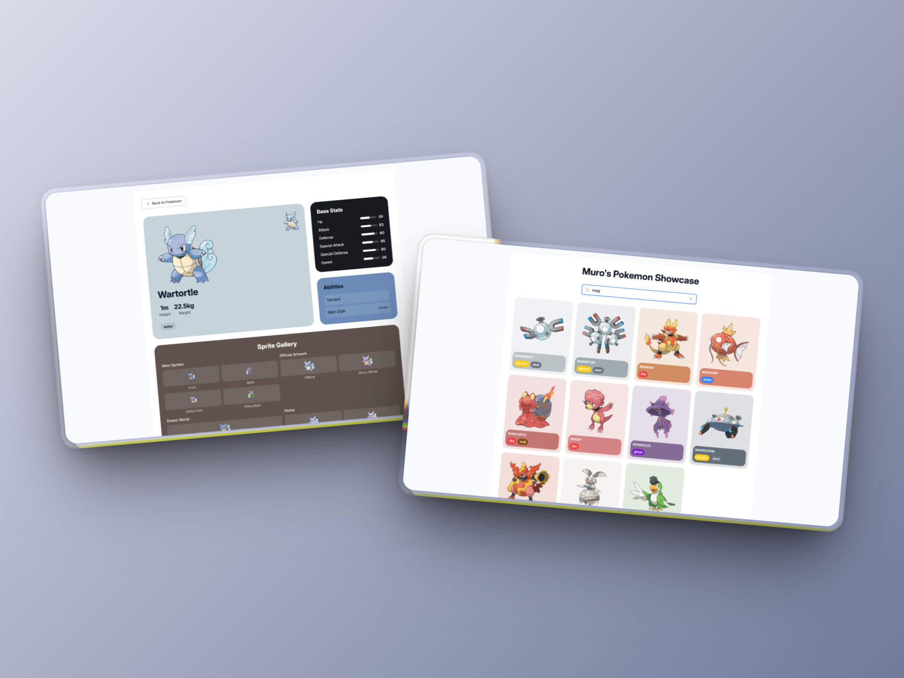

# Pokemon Showcase - Adaptive UI Design

> A Vue 3 Pokemon showcase app experimenting with adaptive UI design based on available images



[Live Demo](https://myurtsev.github.io/pokemon-adaptive-ui-experiment/)

## Features

- **Adaptive UI Design**: Dynamic color extraction from Pokemon images
- **Bento Grid Layout**: Modern card-based layout that adapts to content
- **Smart Text Colors**: Automatic text color adjustment based on background luminance
- **Pokemon API Integration**: Real-time data from PokeAPI
- **Sprite Gallery**: Comprehensive display of Pokemon sprites across generations
- **Vue 3 + TypeScript**: Modern development stack
- **Tailwind CSS**: Utility-first styling
- **ColorThief Integration**: Advanced color palette extraction

## UI Design experiment

This project explores how UI elements can intelligently adapt to their content - in this case, Pokemon images that drive the entire visual design.

The app automatically:
- Extracts color palettes from Pokemon artwork
- Adjusts text colors for optimal readability
- Creates cohesive visual themes for each Pokemon
- Displays comprehensive sprite collections across game generations

## Project setup and usage

Install dependencies:

```
npm install
```

Run development server:

```
npm run dev
```

Build for produciton:

```
npm run build
```

Run ESLint:

```
npm run lint
```

Lint and fix:

```
npm run lint:fix
```

## Contributing

Contributions, feedback and issues are welcome. Feel free to fork, comment, critique, or submit a pull request.

## Acknowledgements

This repo was adapted from [Unihen](https://twitter.com/uninen)'s [vite-ts-tailwind-starter](https://github.com/Uninen/vite-ts-tailwind-starter) project.

## License

This project is open source and available under the [MIT License](LICENSE).

---

Follow [@vincentdoerig](https://twitter.com/vincentdoerig) on Twitter.
